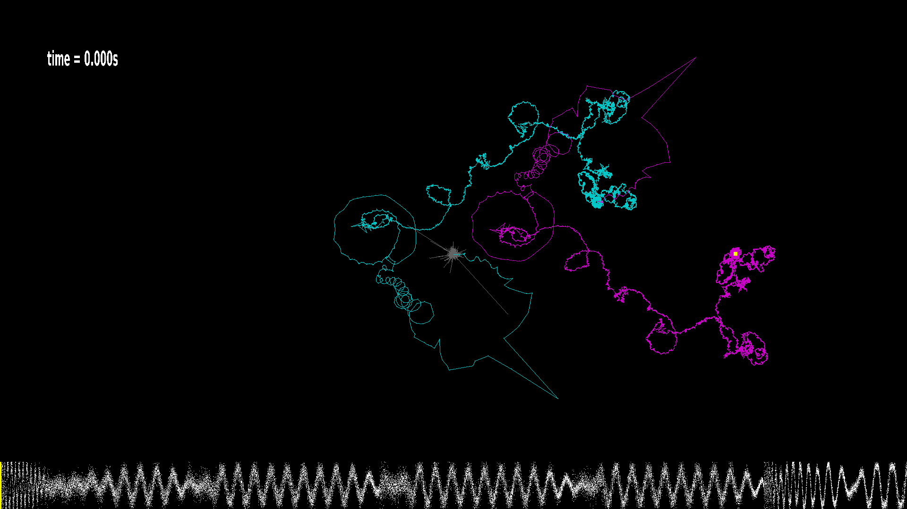

# fft-anything

This Rust code for making fourier transform visualizations from arbitrary WAV files (as long as they're 44100Hz stereo).

**Dependencies:** You will need SDL2 libraries, including SDL2_ttf installed on your system.

There is no documentation! To use it, try:

```
cargo run --release -- -w -r -n 20000 -z 1.0 -s 0.0002 skrillex-1s.wav
```

This will show you how 1s of a Skrillex track can be approximated by 20,000 complex exponentials.

You could also try:

```
cargo run --release -- -r -w -n 1000 -p frames/ -s 0.02 4s.wav
... wait for it to finish (it's writing .png files into ./frames/) ...
./compile-video.sh # (requires ffmpeg)
```

This will generate an animation of how some ~20Hz sine pulses are approximated by complex exponentials. It saves a .png file for each frame into the `frames/` directory, and then `./compile-video.sh` uses ffmpeg to stitch them together into a video.

